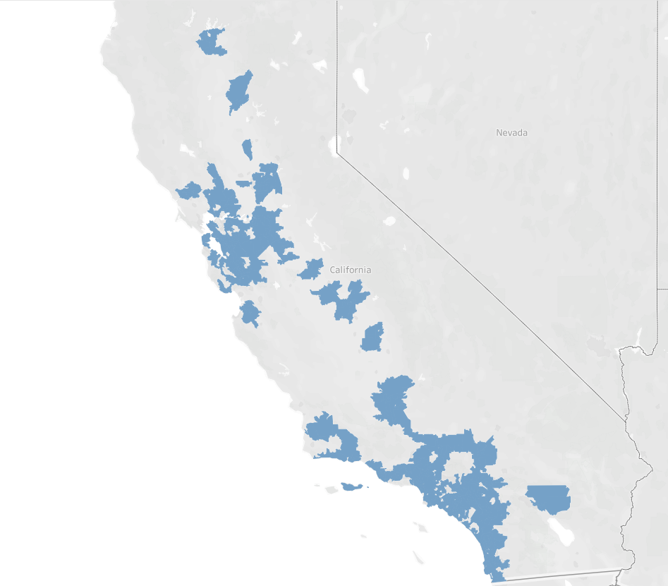

# Welcome to House Pricing Predicting Capstone Project at UC Irvine

Authors: Zhiyan/Gloria Shen, 
Junfeng Li, 
Yuehai Shen

## Notebook Instruction
Open the models_training.ipynb in final_demonstration folder and run the file directly will show the model training part. Codes for other part of the project are in other folders as the folders names shown. 

## House Pricing Predicting 

This project untilize multiple demensions' information to predict the house price for sale in California. We focus on the city whose population is ranked as top 150. The following image high light the area was included in the prediction.

